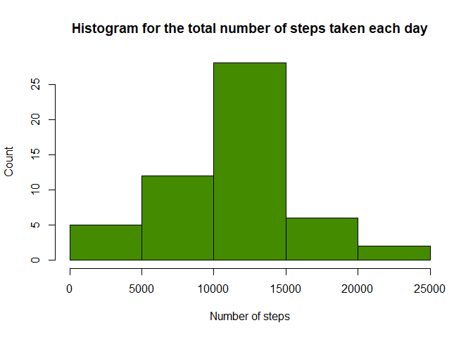
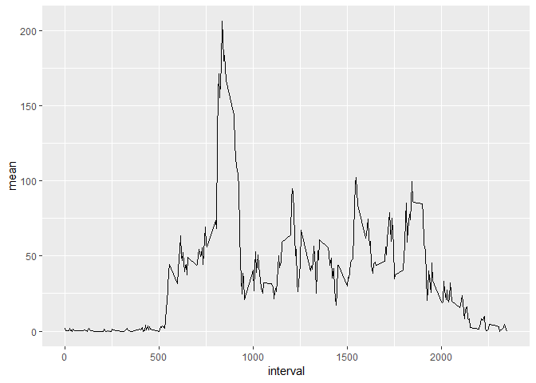
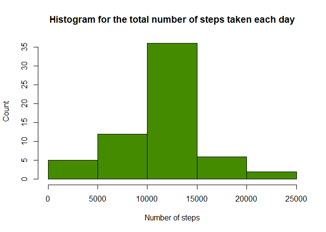
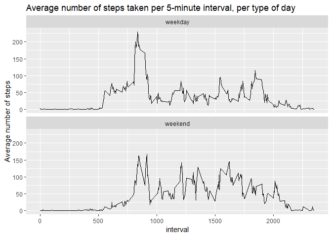

## 1. Introduction
It is now possible to collect a large amount of data about personal movement using activity monitoring devices such as a Fitbit, Nike Fuelband, or Jawbone Up. These type of devices are part of the "quantified self" movement - a group of enthusiasts who take measurements about themselves regularly to improve their health, to find patterns in their behavior, or because they are tech geeks. But these data remain under-utilized both because the raw data are hard to obtain and there is a lack of statistical methods and software for processing and interpreting the data.

This report makes use of data from a personal activity monitoring device. This device collects data at 5 minute intervals through out the day. The data consists of two months of data from an anonymous individual collected during the months of October and November, 2012 and include the number of steps taken in 5 minute intervals each day.


## 2. The data
The data used in this report can be downloaded from below link: 
Dataset: [Activity monitoring data](https://d396qusza40orc.cloudfront.net/repdata%2Fdata%2Factivity.zip)

The variables included in this dataset are:
- steps: Number of steps taking in a 5-minute interval (missing values are coded as NA)
- date: The date on which the measurement was taken in YYYY-MM-DD format
- interval: Identifier for the 5-minute interval in which measurement was taken
- The dataset is stored in a comma-separated-value (CSV) file and there are a total of 17,568 observations in this dataset.


## 3. Set up
First, the default of all code chunks in this R markdown document is set to echo=TRUE, ensuring that the code used to generate the output
is presented in the document. The R environment is set up by loading necessary packages. Setting the working directory is not necessary since the Rmd file uses the directory it resides in as the base directory. 


```r
knitr::opts_chunk$set(echo = TRUE)
```


```r
library(rstudioapi)
library(dplyr)
library(ggplot2)
library(knitr)
```

## 4. Loading and preprocessing the data
Load the data (i.e. read.csv()), Process/transform the data (if necessary) into a format suitable for the analysis


```r
# The data is directly loaded from the zipfile activity.zip: 
data <- read.csv(unzip("activity.zip", files="activity.csv"))

# Change the date variable to date format:
data$date <- as.Date(data$date)
```


## 5. What is mean total number of steps taken per day?
For this part of the assignment, the missing values in the dataset are ignored.

#### 5.1 Calculate the total number of steps taken per day

```r
# Total steps per day:
steps_perday <- data %>% 
  group_by(date) %>% 
  summarise(steps = sum(steps))
```

#### 5.2 Make a histogram of the total number of steps taken each day


```r
hist(steps_perday$steps, 
     main = "Histogram for the total number of steps taken each day",
     xlab = "Number of steps",
     ylab = "Count",
     col = "chartreuse4")
```

<!-- -->

#### 5.3 Calculate and report the mean and median of the total number of steps taken per day

```r
mean_total_steps <- round(mean(steps_perday$steps, na.rm=TRUE), 1)
median_total_steps <- round(median(steps_perday$steps, na.rm=TRUE), 1)
```

The mean of the total number of steps taken per day is: 10766.2.
The mean of the total number of steps taken per day is: 10765.

## 6. What is the average daily activity pattern?

#### 6.1 Make a time series plot (i.e. type = "l") of the 5-minute interval (x-axis) and the average number of steps taken, averaged across all days (y-axis)

```r
# Group the data by interval:
daily_pattern <- data %>% 
  group_by(interval) %>% 
  summarise(totalsteps = sum(steps,  na.rm=TRUE), mean = mean(steps,  na.rm=TRUE), median = median(steps,  na.rm=TRUE))

# Make a lineplot:
ggplot(data=daily_pattern, aes(x=interval, y=mean)) +
    geom_line()
```

<!-- -->

#### 6.2 Which 5-minute interval, on average across all the days in the dataset, contains the maximum number of steps?

```r
max_interval <- daily_pattern[which.max(daily_pattern$mean), 'interval']
```

The 5-minute interval that, on average across all the days in the dataset, contains the 
maximum number of steps is: 835.


## 7. Imputing missing values
Note that there are a number of days/intervals where there are missing values (coded as NA). The presence of missing days may introduce bias into some calculations or summaries of the data.

#### 7.1 Calculate and report the total number of missing values in the dataset (i.e. the total number of rows with NA)


```r
nrows_withNA <- sum(is.na(data$steps))
```

The total number of missing values in the dataset (i.e. the total number of rows with NA) is: 2304.

#### 7.2 Devise a strategy for filling in all of the missing values in the dataset & create a new dataset that is equal to the original dataset but with the missing data filled in.
The chosen strategy for filling in all of the missing values in the dataset is: filling in the mean for that date.


```r
data_2 <- data %>% 
    group_by(interval) %>% 
    mutate(steps = ifelse(is.na(steps), mean(steps, na.rm = T), steps))
```

#### 7.3 Make a histogram of the total number of steps taken each day

```r
# Group the data based on date:
steps_perday2 <- data_2 %>% 
  group_by(date) %>% 
  summarise(steps = sum(steps))

hist(steps_perday2$steps, 
     main = "Histogram for the total number of steps taken each day",
     xlab = "Number of steps",
     ylab = "Count",
     col = "chartreuse4")
```

<!-- -->


#### 7.2 Calculate and report the mean and median total number of steps taken per day. 

```r
mean_total_steps2 <- round(mean(steps_perday2$steps, na.rm=TRUE), 1)
median_total_steps2 <- round(median(steps_perday2$steps, na.rm=TRUE), 1)
```

The mean of the total number of steps taken per day is: 1.07662\times 10^{4}.
The mean of the total number of steps taken per day is: 1.07662\times 10^{4}.

#### 7.3 Do these values differ from the estimates from the first part of the assignment? What is the impact of imputing missing data on the estimates of the total daily number of steps?

```r
library(knitr)
df <- data.frame("type" = c("With NA's", "without NA's (filled by mean)"),
                 "mean"= c(mean_total_steps, mean_total_steps2),
                 "median" = c(median_total_steps, median_total_steps2))
kable(df)
```


type                                mean    median
------------------------------  --------  --------
With NA's                        10766.2   10765.0
without NA's (filled by mean)    10766.2   10766.2

The strategy of filling in the missing values with the mean of that day does not have any consequences for the mean. However, the median has become the same as the mean. This makes sense since all missing values are now filled in with the mean, which increases the number of times this value is present in the dataset.


## 8. Are there differences in activity patterns between weekdays and weekends?
For this part the weekdays() function may be of some help here. Use the dataset with the filled-in missing values for this part.

### 8.1 Create a new factor variable in the dataset with two levels - "weekday" and "weekend" indicating whether a given date is a weekday or weekend day.

```r
data_2$day_type <- ifelse(weekdays(data_2$date) %in% c("zaterdag", "zondag"), "weekend", "weekday")
```

### 8.2 Make a panel plot containing a time series plot of the 5-minute interval (x-axis) and the average number of steps taken, averaged across all weekday days or weekend days (y-axis). 

```r
# Group the data by interval:
daily_pattern2 <- data_2 %>% 
  group_by(interval, day_type) %>% 
  summarise(mean = mean(steps,  na.rm=TRUE))

# Make a lineplot:
g <- ggplot(data=daily_pattern2, aes(x=interval, y=mean, group = day_type))
g + geom_line() + facet_wrap(~day_type, nrow=2, ncol=1) +
ggtitle("Average number of steps taken per 5-minute interval, per type of day") +
ylab("Average number of steps")
```

<!-- -->


